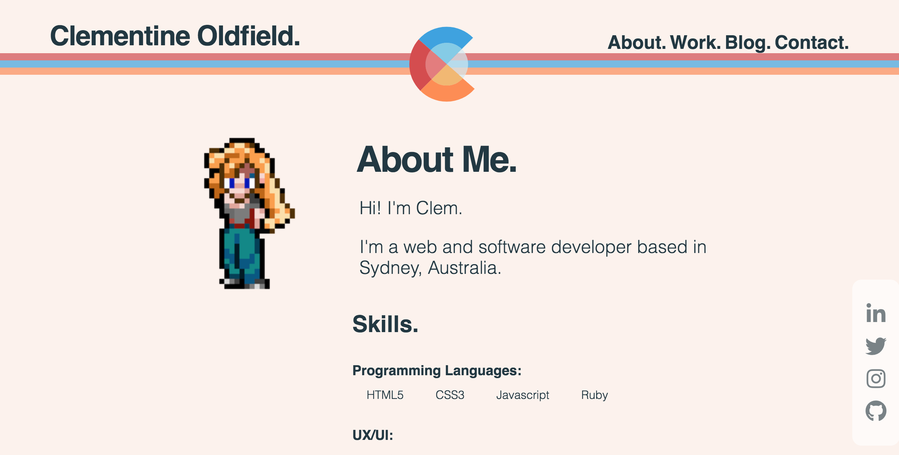

# Clementine Oldfield
## Portfolio (A1-3)
Coder Academy. 2019.

----------


<!-- A link (URL) to your published portfolio website
A link to your GitHub repository
Ensure the repository (repo) is accessible by your Educators -->

### Github Link
https://github.com/ClementineOldfield/portfolio-march2019

### Website Link
https://clementineoldfield.github.io/

<!-- Description of your portfolio website, including,
Purpose
Functionality / features -->

---------
## Project Aim

A website that will showcase my talent, abilities and coding experience.

The site should be responsive, accessible and have a pleasing design. The content will include:
```
- My contact details.
- A link to my Github & Linkedin.
- Information about me to demonstrate my personality
- My study & work history
```

## Functionality / Features
### Sitemap

The basic site architecture is as below:


### Target Audience
The target audience for this site is potential future employers and collaborators.

### Tech Stack
For this project I used:
- HTML5
- CSS3
- Sass
- Javascript
- Github for version control & deployment

## Project Plan & Timeline

For the whole project I used Trello as a project management application.

#### Day 1 - Tuesday

- Brainstorming and Ideation. 
- Create a mood board on Pinterest
- Sketch Wireframes
- Get started on documentation
- Develop wireframes

#### Day 2 - Wednesday

- Basic HTML structure
- Styling (no animations yet)
- Responsive Design (mobile first)

#### Day 3 - Thursday

- Applying CSS Animations & Basic Javascript
- Write the documentation to respond to the question in the assessment brief.

#### Day 4 - Friday

- Website development.
- Adjusting the scope of the project to meet the deadline.
- AIM TO FINISH TODAY

#### Day 5 & 6 - Saturday & Sunday

- Final changes to website & README
- DUE: Sunday - 22:00

## Design Process
-------

Before starting any design at all, I mapped out the content that would need to be displayed on the site. Using trello to brainstorm, I got a pretty good idea of the total amount of content that would potentially be included in the final product. After this point I could start to prioritise the content in my head and get started on the wireframes.


### Inspiration & Moodboarding

My initial inspiration for the mood of the design came from the style of designers such as Massimo Vignelli. I wanted to emulate the bright contrasting colours alongside the minimalist style present in his works. 


##### Mood Board


I also like to experiment with pixel art and had created a small avatar of myself (pictured below) that I wanted to incorporate, largely inspired by the pixel style of the Super Nintendo game "Chrono Trigger". 


##### Colour

The colour scheme I decided on was quite a bright one. I wanted three primary colours that would stand out and two very muted ones to support them. The complimentary pairing of blue and orange was my starting point, and the red brought a nice contrast to the trio. The off-white and off-black would be my background and text colours.<br>


##### Logo
Another important design element was my logo. Using my initials as a starting point, and incorporating the colour palette, this is what I came up with.

I was able to turn this into an SVG so that I could affect each segment individually with CSS. Here is an example from the finished site:


*Logo effect on hover*
<br>

### Wireframes

My initial wireframes were very rough. I wanted to go for a minimalist design, so I was hesitant to put too much detail in to begin with. I know how over enthusiastic I can get with adding features as I go so I wanted to allow for a little bit of that. 


#### Hand Drawn Wireframes

<br>

I translated these into some slightly higher fidelity digital wireframes (pictured below). At this point I could get a better idea of the size of the content within the page. I focused on the mobile design first and was happy with how this helped me to strip down my design and make it as minimal as possible.


<!--
Screenshots of finished website-->





<!--
Usability considerations
Details of planning process including,
Project plan & timeline
Screenshots of Trello board(s)
Short Answer Q&A - Include short answers to the following questions,
Describe key events in the development of the internet from the 1980s to today (max. 150 words)
Define and describes the relationship between fundamental aspects of the internet such as: domains, web servers, DNS, and web browsers (max. 150 words)
Reflect on one aspect of the development of internet technologies and how it has contributed to the world today (max. 150 words) -->

