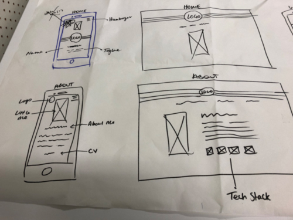
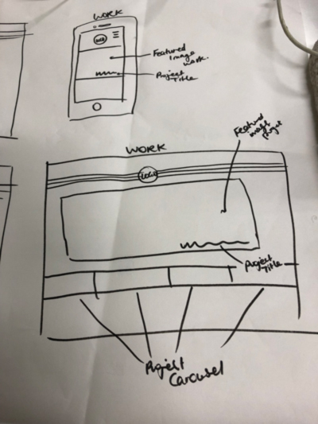

# portfolio-march2019
Developer Portfolio 2019. 

<!-- A link (URL) to your published portfolio website
A link to your GitHub repository
Ensure the repository (repo) is accessible by your Educators -->

### Github Link
https://github.com/ClementineOldfield/portfolio-march2019

### Website Link

<!-- Description of your portfolio website, including,
Purpose
Functionality / features -->

## Site Description
---------

### Functionality / Features

<!--
Sitemap
Screenshots
Target audience
Tech stack (e.g. html, css, deployment platform, etc) -->

<!--
Design documentation including,
Design process
Wireframes
Personal logo (optional) -->

## Project Plan & Timeline
------

#### Day 1 - Tuesday

- Brainstorming and Ideation. 
- Create a mood board on Pinterest
- Sketch Wireframes
- Get started on documentation
- Develop wireframes

#### Day 2 - Wednesday

- Basic HTML structure
- Styling (no animations yet)
- Responsive Design (mobile first)

#### Day 3 - Thursday

- Applying CSS Animations & Basic Javascript
- Write the documentation to respond to the question in the assessment brief.

#### Day 4 - Friday

- Website development.
- Adjusting the scope of the project to meet the deadline.
- AIM TO FINISH TODAY

#### Day 5 & 6 - Saturday & Sunday

- Final changes to website & README
- DUE: Sunday - 22:00

## Design Process
-------

Before starting any design at all, I mapped out the content that would need to be displayed on the site. Using trello to brainstorm, I got a pretty good idea of the total amount of content that would potentially be included in the final product.

After this point I could start to prioritise the content in my head and get started on the wireframes.

### Wireframes

My initial wireframes were very rough. I wanted to go for a minimalist design to begin with, so I was hesitant to put too much detail in to begin with. I know how over enthusiastic I can get with adding features as I go so I wanted to allow for a little bit of that. 

#### Hand Drawn Wireframes

I translated these into some slightly higher fidelity digital wireframes (pictured below). At this point I could get a better idea of the size of the content within the page. I focused on the mobile design first and was happy with how this helped me to strip down my design and make it as minimal as possible.

  

## Inspiration

<!--
Usability considerations
Details of planning process including,
Project plan & timeline
Screenshots of Trello board(s)
Short Answer Q&A - Include short answers to the following questions,
Describe key events in the development of the internet from the 1980s to today (max. 150 words)
Define and describes the relationship between fundamental aspects of the internet such as: domains, web servers, DNS, and web browsers (max. 150 words)
Reflect on one aspect of the development of internet technologies and how it has contributed to the world today (max. 150 words) -->
